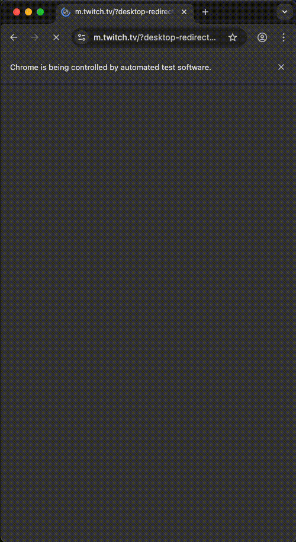

# SportyTwitch – Mobile Web UI Test Automation

This project contains a Selenium + Pytest automated UI test for the Twitch mobile web application, implemented using the Page Object Model.

---

## Tech Stack

- Python 3
- Selenium WebDriver
- Pytest
- Google Chrome (Mobile Emulation)

---

## Test Scenario

**Web App Testing – Mobile Emulation**

1. Open Twitch mobile web (`https://m.twitch.tv`)
2. Tap the search icon
3. Search for **StarCraft II**
4. Scroll down the search results
5. Select the first streamer
6. Handle optional modals (content classification, muted audio)
7. Wait until the video player is loaded
8. Take a screenshot at the end of the test

---

## Project Structure

- `pages/` – Page Object classes encapsulating UI interactions
- `tests/` – Pytest test cases
- `utils/` – Browser and driver setup utilities
- `config/` – Configuration values
- `screenshots/` – Test execution screenshots

## Run
pip install -r requirements.txt
pytest -v

## Test Run

